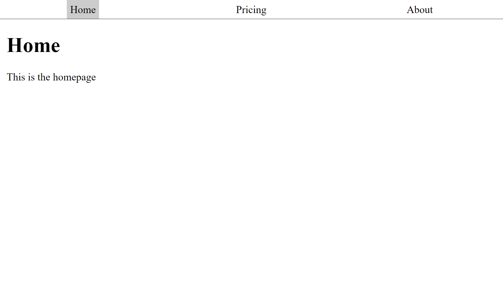
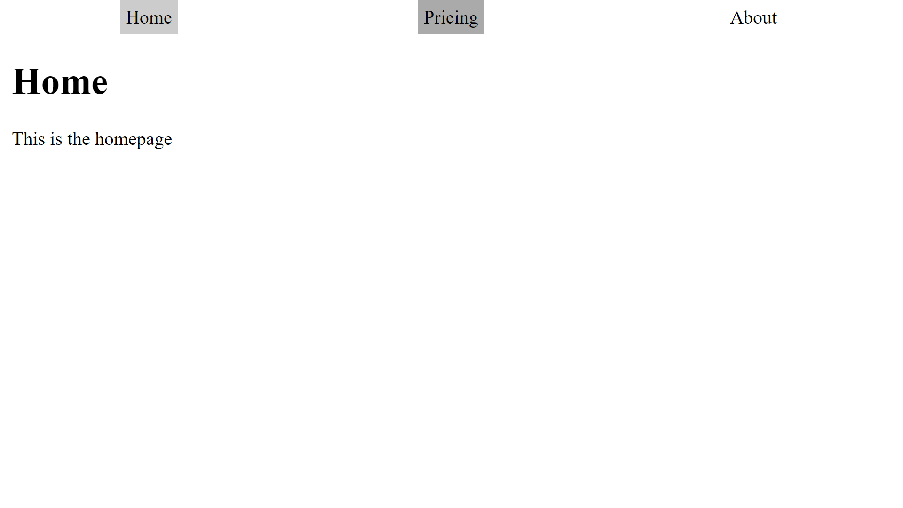
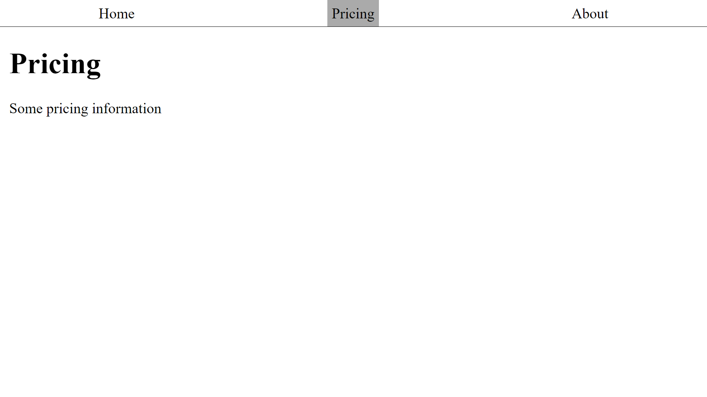
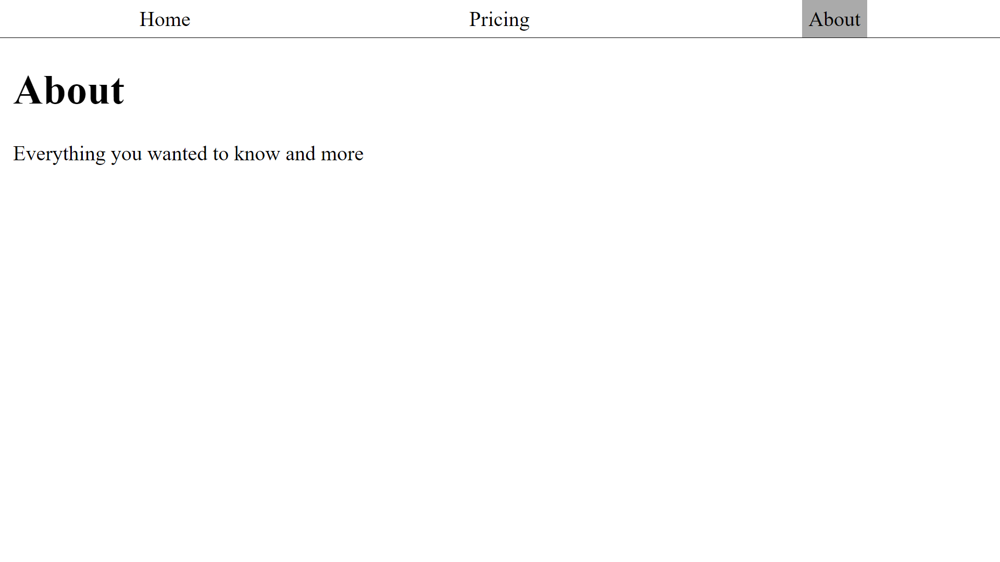
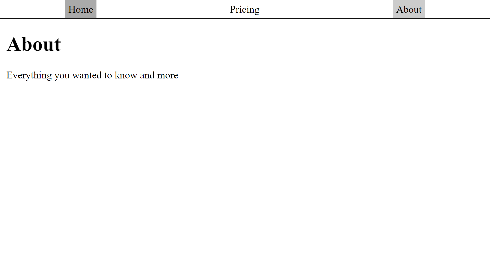

# build-tabs-html-css-tutorial-WDS

This great [tutorial](https://www.youtube.com/watch?v=5L6h_MrNvsk&list=PLZlA0Gpn_vH8DWL14Wud_m8NeNNbYKOkj&index=30) from [Web Dev Simplified](https://www.youtube.com/channel/UCFbNIlppjAuEX4znoulh0Cw) is a great introduction to functional javascript. The javascript is used to enhance the functionality of the HTML and the CSS. None of the code is mine.

Here are the tabs when the page is opened. The 'Home' tab is the default.

On hover the tab is slightly darker:

Here is the pricing 'page':

Here is the about 'page':

Getting ready to go back home!

My rendering of this tutorial is [published on GitHub](https://martucazpo.github.io/build-tabs-html-css-tutorial-WDS/).